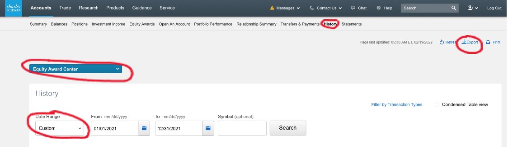
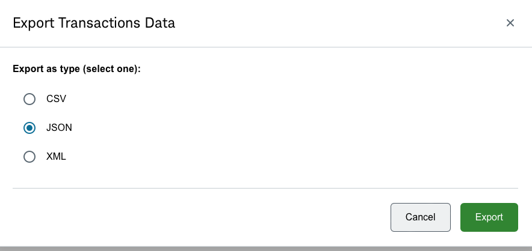
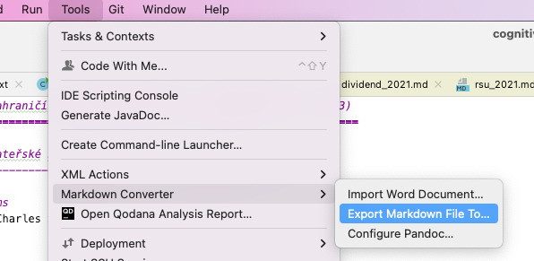

# Cockroach will help you with your taxes

This small utility is for people using [Charles Schwab brokerage](https://www.schwab.com/) services in
the [Czech Republic](https://en.wikipedia.org/wiki/Czech_Republic).

The program reads the Schwab export of your stock transactions and creates a summary of your sales and purchases
for the tax year.

# Obtaining Schwab CSV export for last year

1.  Go to "History" tab.

2.  Choose "Equity Award Center" from the dropdown.

3.  Chose "Custom" Data range and interval from the last year (with
    overlap)
    -   Some events (e.g. ESPP) are reported with delay, so overlap of
        several days is necessary.
    -   Alternatively, you can export everything.
    - 

4.  Click "Export"

5.  Select "JSON" radio button, click "Export"

# Running the application

-   Compile and run
    cockroach/src/main/java/cz/solutions/cockroach/CockroachMain.java

-   it gets 3 command line arguments - path to csv export, year, and
    output dir.

-   it uses templates located here:
    cockroach/src/main/resources/cz/solutions/cockroach

-   the output are 4 simple .md files

-   In InteliJ IDEA, you can convert the md files into pdf in Markdown
    export options under Tools \> Markdown Converter menu.\
    

# Compiling and Running (probably very redundant information)

mvn clean install -am

mvn clean install shade:shade

java -jar target/cockroach-0.1-SNAPSHOT.jar /tmp/219114411.json 2023
/tmp/taxes

# Converting to PDF

-   pandoc sales_2021.md -V geometry:landscape
    \--pdf-engine=/Library/TeX/texbin/pdflatex -o sales.pdf

-   IDEA: Tools -\> Markdown Converter
