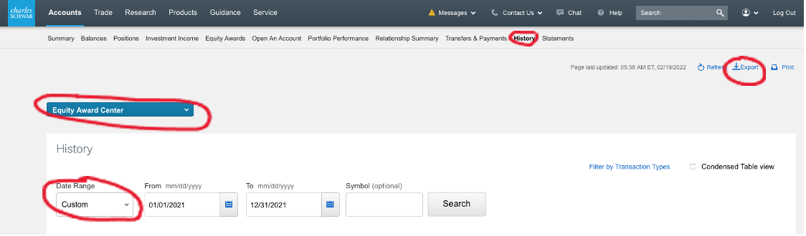
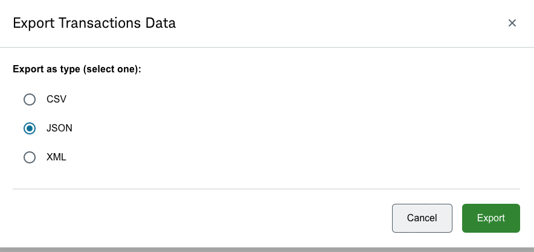
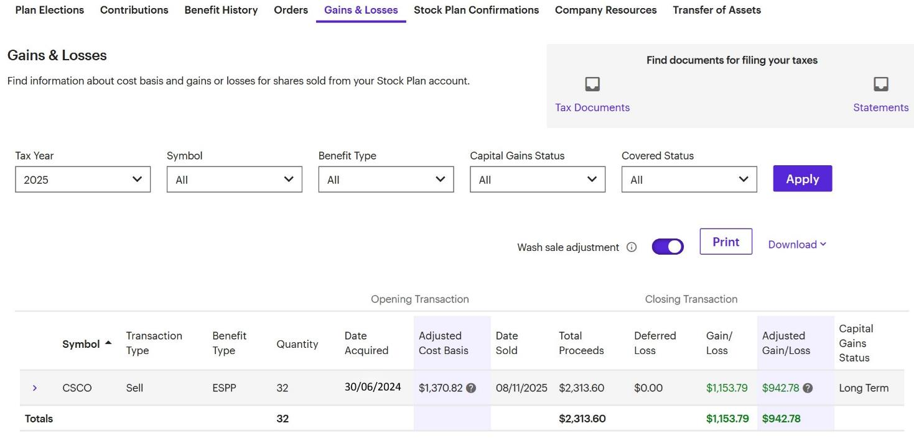
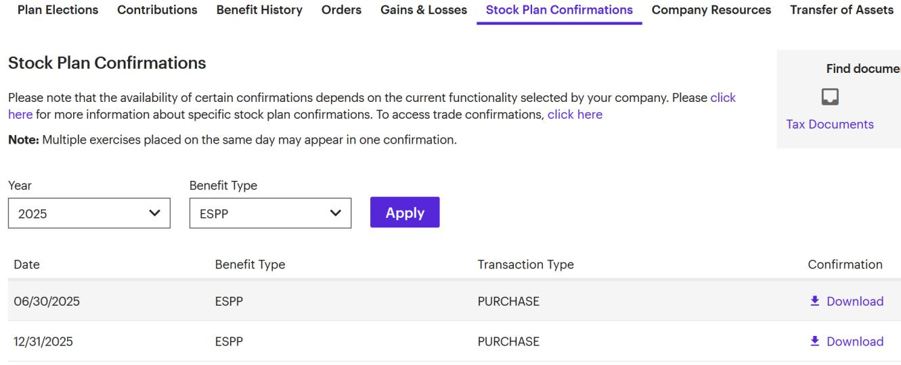
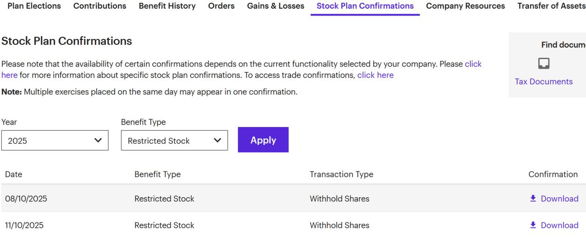
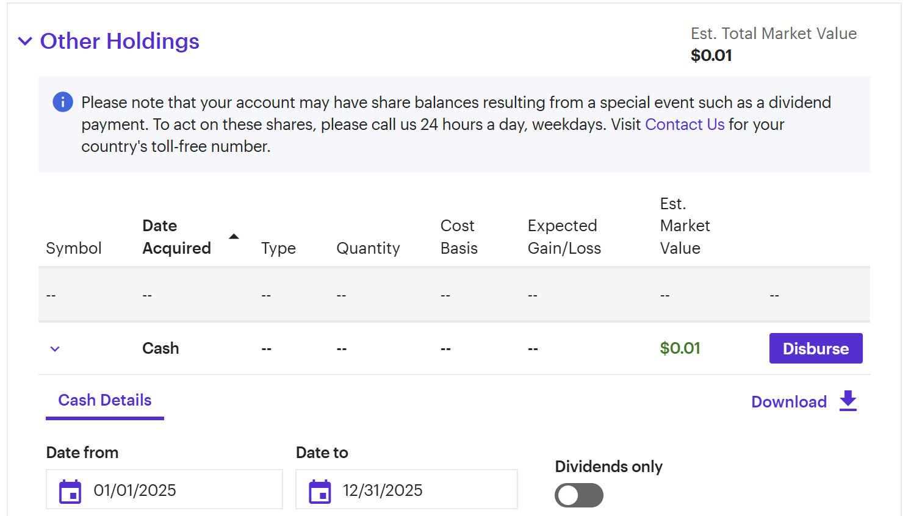
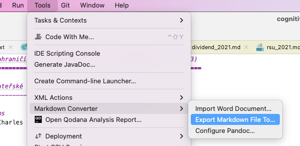

# Cockroach will help you with your taxes

This small utility is for people using [Charles Schwab brokerage](https://www.schwab.com/) and/or
[E-Trade](https://www.etrade.com/) services in the [Czech Republic](https://en.wikipedia.org/wiki/Czech_Republic).

The program reads the Schwab JSON export of your stock transactions and optionally an E-Trade Gain and Loss CSV
export, then creates a summary of your sales and purchases for the tax year.

# Obtaining Schwab CSV export for last year

1.  Go to "Transaction History" tab.

2.  Choose "Equity Award Center" from the dropdown.

3.  Chose "Custom" Data range and interval from the last year (with
    overlap)
    -   Some events (e.g. ESPP) are reported with delay, so overlap of
        several days is necessary.
    -   Alternatively, you can export everything.
    - 

4.  Click "Export"

5.  Select "JSON" radio button, click "Export"



# Obtaining E-Trade Gain and Loss CSV export

1.  Go to [Gains & Losses](https://us.etrade.com/etx/sp/stockplan?accountIndex=0&traxui=tsp_accountshome#/myAccount/gainsLosses).

2.  Select Year **2025**, Benefit type **All**, Capital Gain Status **All**, Covered Status **All**.
    

3.  Click **Download** → **Download Collapsed** to export the data as CSV.
 
4.  Save the csf into directory called 'sales'

# Obtaining E-Trade ESPP confirmation PDFs

1.  Go to [Stock Plan Confirmations](https://us.etrade.com/etx/sp/stockplan?accountIndex=0&traxui=tsp_accountshome#/myAccount/stockPlanConfirmations).

2.  Select the relevant year and Benefit type: **ESPP**.
    

3.  Download all available confirmations.
 
4. Save the PDFs into directory called 'espp'

# Obtaining E-Trade RSU release confirmation PDFs

1.  Go to [Stock Plan Confirmations](https://us.etrade.com/etx/sp/stockplan?accountIndex=0&traxui=tsp_accountshome#/myAccount/stockPlanConfirmations).

2.  Select the relevant year and Benefit type: **Restricted stock units**.
    

3.  Download all available confirmations.
 
4. Save the PDFs into directory called 'rsu'

# Obtaining E-Trade Dividends XLSX export

1.  Go to [Holdings](https://us.etrade.com/etx/sp/stockplan#/holdings).

2.  Scroll down to **Other Holdings**, expand it and then expand **Cash transactions**.
    Select the right date range. Don't tick "Dividends only" because you also want to see
    the withholding tax rows.
    

3.  Download the report as **Excel**.

4.  Save the XLSX file into directory called 'dividends'

    

## E-Trade Gain and Loss CSV format

The file is a semicolon-delimited CSV using European number formatting (comma as
decimal separator, space as thousands separator, `$` prefix for currency values).
It contains 47 columns. The first data row is a `Summary` row (ignored by the parser),
followed by individual `Sell` rows.

Key columns used by the parser:

| Column | Index | Description |
|--------|-------|-------------|
| Record Type | 0 | `Summary` or `Sell` |
| Plan Type | 2 | e.g. `RS` for Restricted Stock |
| Quantity | 3 | Number of shares sold |
| Adjusted Cost Basis Per Share | 11 | Vest FMV per share (used instead of the corrupted Vest Date FMV column) |
| Date Sold | 12 | Sale date in MM/DD/YYYY format |
| Proceeds Per Share | 14 | Sale price per share |
| Grant Number | 39 | Grant identifier |
| Vest Date | 41 | Vesting date in MM/DD/YYYY format |

Example (header + one data row):

```
Record Type;Symbol;Plan Type;Quantity;Date Acquired;...;Adjusted Cost Basis Per Share;Date Sold;Total Proceeds;Proceeds Per Share;...;Grant Number;...;Vest Date;Vest Date FMV;...
Sell;ACME;RS;100;06/15/2025;...;$65,50;06/16/2025;$6 800,00;$68,00;...;1234567;...;06/15/2025;...;...
```

In this example, 100 RSU shares vested on 06/15/2025 at a FMV of $65.50 per share
and were sold the next day at $68.00 per share.

**Note:** The E-Trade Gain and Loss report only contains shares that were actually
sold. RSUs that vested but have not yet been sold will not appear in this file.
If you need to report income from unsold vestings, you will need to obtain that
information separately (e.g. from E-Trade confirmation PDFs or vesting statements).

# Running the application

-   Compile and run
    cockroach/src/main/kotlin/cz/solutions/cockroach/CockroachMain.kt

-   it gets 3 required command line arguments - path to Schwab JSON export, year, and
    output dir. An optional 4th argument specifies the path to the E-Trade Gain and Loss CSV file.

-   it uses templates located here:
    cockroach/src/main/resources/cz/solutions/cockroach

-   the output are 4 simple .md files and an HTML guide

-   In InteliJ IDEA, you can convert the md files into pdf in Markdown
    export options under Tools \> Markdown Converter menu.\
    

# Compiling and Running

mvn clean install -am

mvn clean install shade:shade

java -jar target/cockroach-0.2-SNAPSHOT.jar /tmp/219114411.json 2025 /tmp/taxes

With E-Trade data:

java -jar target/cockroach-0.2-SNAPSHOT.jar /tmp/219114411.json 2025 /tmp/taxes /tmp/e-trade-gain-and-loss-2025.csv

# Converting to PDF

-   pandoc sales_2021.md -V geometry:landscape
    \--pdf-engine=/Library/TeX/texbin/pdflatex -o sales.pdf

-   IDEA: Tools -\> Markdown Converter
