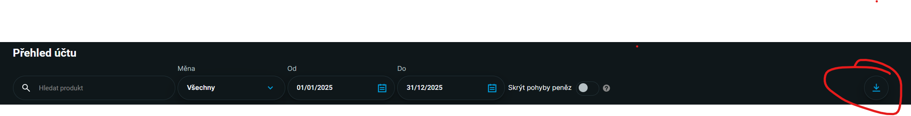

# Cockroach will help you with your taxes

This small utility is for people using [Charles Schwab brokerage](https://www.schwab.com/),
[E-Trade](https://www.etrade.com/) and/or [Degiro](https://www.degiro.com/) services in the
[Czech Republic](https://en.wikipedia.org/wiki/Czech_Republic).

The program reads the Schwab JSON export of your stock transactions, optionally an E-Trade Gain and Loss
XLSX/CSV export, and optionally a Degiro account statement (`.xls`), then creates a summary of your sales,
purchases and dividends for the tax year.

All input files referenced in this README (and the YAML config) are assumed to live under the
`input/` folder at the repository root (which is git-ignored). See the [Input layout](#input-layout)
section below for the exact directory structure.

# Obtaining Schwab CSV export for last year

1.  Go to "Transaction History" tab.

2.  Choose "Equity Award Center" from the dropdown.

3.  Chose "Custom" Data range and interval from the last year (with
    overlap)
    -   Some events (e.g. ESPP) are reported with delay, so overlap of
        several days is necessary.
    -   Alternatively, you can export everything.
    - 

4.  Click "Export"

5.  Select "JSON" radio button, click "Export"


6.  Save the JSON file into `input/`.


# Obtaining E-Trade Gain and Loss XLSX export

1.  Go to [Gains & Losses](https://us.etrade.com/etx/sp/stockplan?accountIndex=0&traxui=tsp_accountshome#/myAccount/gainsLosses).

2.  Select Year **2025**, Benefit type **All**, Capital Gain Status **All**, Covered Status **All**.
    

3.  Click **Download** → **Download Expanded** to export the data as XLSX.

4.  Save the xlsx into `input/etrade/sales/`.

# Obtaining E-Trade ESPP confirmation PDFs

1.  Go to [Stock Plan Confirmations](https://us.etrade.com/etx/sp/stockplan?accountIndex=0&traxui=tsp_accountshome#/myAccount/stockPlanConfirmations).

2.  Select the relevant year and Benefit type: **ESPP**.
    

3.  Download all available confirmations.

4.  Save the PDFs into `input/etrade/espp/`.

# Obtaining E-Trade RSU release confirmation PDFs

1.  Go to [Stock Plan Confirmations](https://us.etrade.com/etx/sp/stockplan?accountIndex=0&traxui=tsp_accountshome#/myAccount/stockPlanConfirmations).

2.  Select the relevant year and Benefit type: **Restricted stock units**.
    

3.  Download all available confirmations.

4.  Save the PDFs into `input/etrade/rsu/`.

# Obtaining E-Trade Dividends XLSX export

1.  Go to [Holdings](https://us.etrade.com/etx/sp/stockplan#/holdings).

2.  Scroll down to **Other Holdings**, expand it and then expand **Cash transactions**.
    Select the right date range. Don't tick "Dividends only" because you also want to see
    the withholding tax rows.
    

3.  Download the report as **Excel**.

4.  Save the XLSX file into `input/etrade/dividends/`.

# Obtaining Degiro account statement

1.  Log in to [Degiro Account Overview](https://trader.degiro.nl/trader/#/account-overview) and open **Inbox → Account Statement**
    (Czech: *Inbox → Přehled účtu*).

2.  Set the date range to cover the relevant tax year (overlap of a few days at both ends is
    safe; only rows whose **value date** (`Datum valuty`) falls inside the requested year are
    used for the report).
    
3.  Export as **XLS**.

4.  Save the file into `input/` (e.g. `input/Accounts_Degiro_2025.xls`).

Notes:
- Only `Dividenda` and `Daň z dividendy` rows are used.
- `ADR/GDR Pass-Through poplatek` rows are custody fees (not withholding tax) and are
  ignored; the total amount that was skipped is logged on stdout for transparency.
- All currencies present in the file (USD, EUR, CZK, ...) are handled; the daily CNB rate
  for the value date is used for FX conversion.

# Input layout

All inputs (broker exports and the YAML config) live under `input/`. A typical layout is:

```
input/
├── config.yaml
├── schwab-export.json              # Schwab JSON export
├── Accounts_Degiro.xls             # Degiro account statement
└── etrade/                         # E-Trade data directory
    ├── rsu/         *.pdf          # RSU release confirmations
    ├── espp/        *.pdf          # ESPP purchase confirmations
    ├── dividends/   *.xlsx         # single dividends export
    └── sales/       *.xlsx         # single Gain & Loss export
```

Each broker is optional; include only what applies to you.

# Running the application

There are two ways to invoke the tool:

## YAML config (recommended for multi-broker setups)

Create `input/config.yaml` describing the inputs and run with a single argument:

```yaml
year: 2025
outputDir: ./output
schwab: ./input/schwab-export.json    # optional
etrade: ./input/etrade                # optional, layout shown above
etradeBenefitHistory: ./input/BenefitHistory.xlsx   # optional; alternative to etrade/rsu + etrade/espp
degiro:                               # optional, list of Degiro .xls files
  - ./input/Accounts_Degiro_2024.xls
```

```
java -jar target/cockroach-0.3-SNAPSHOT.jar input/config.yaml
```

At least one of `schwab`, `etrade`, `degiro` must be present.

## Positional arguments (legacy, Schwab + E-Trade only)

-   Compile and run
    cockroach/src/main/kotlin/cz/solutions/cockroach/CockroachMain.kt

-   it gets 3 required command line arguments - path to Schwab JSON export, year, and
    output dir. An optional 4th argument specifies the path to the E-Trade data directory.

-   it uses templates located here:
    cockroach/src/main/resources/cz/solutions/cockroach

-   the output are PDF reports and an HTML guide for both fixed and dynamic exchange-rate
    variants.

-   In InteliJ IDEA, you can convert the md files into pdf in Markdown
    export options under Tools \> Markdown Converter menu.\
    

# Compiling and Running

mvn clean install -am

mvn clean install shade:shade

java -jar target/cockroach-0.3-SNAPSHOT.jar input/schwab-export.json 2025 ./output

With E-Trade data:

java -jar target/cockroach-0.3-SNAPSHOT.jar input/schwab-export.json 2025 ./output input/etrade

With YAML config (Schwab and/or E-Trade and/or Degiro):

java -jar target/cockroach-0.3-SNAPSHOT.jar input/config.yaml

# Converting to PDF

-   pandoc sales_2021.md -V geometry:landscape
    \--pdf-engine=/Library/TeX/texbin/pdflatex -o sales.pdf

-   IDEA: Tools -\> Markdown Converter
